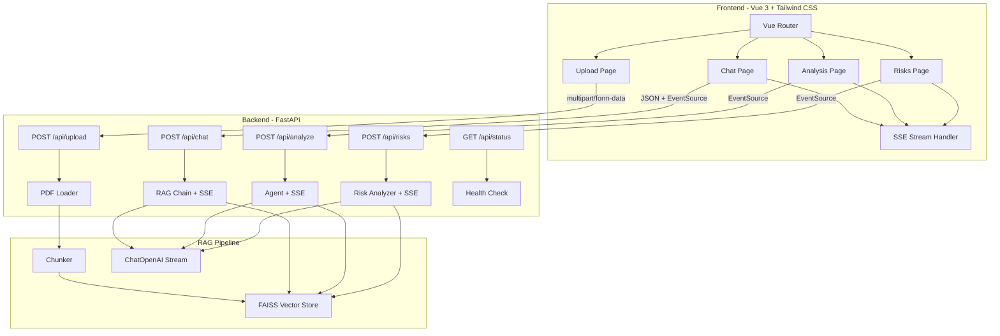

# Tender AI Assistant — Architecture Plan

## Overview

Modern web application for tender document analysis using RAG (Retrieval-Augmented Generation).

**Stack**: FastAPI (Python backend) + Vue 3 (SPA frontend) + Tailwind CSS + SSE streaming

---

## Architecture Diagram



---

## Project Structure

```
c:/tender/
├── backend/
│   ├── main.py              # FastAPI app + CORS + routes
│   ├── requirements.txt     # Python dependencies
│   ├── api/
│   │   ├── __init__.py
│   │   ├── upload.py        # PDF upload endpoint
│   │   ├── chat.py          # Q&A with SSE streaming
│   │   ├── analyze.py       # Full analysis with SSE
│   │   └── risks.py         # Risk analysis with SSE
│   ├── rag/
│   │   ├── __init__.py
│   │   ├── loader.py        # PDF text extraction
│   │   ├── chunker.py       # Text splitting
│   │   ├── vector_store.py  # FAISS create/load/save
│   │   ├── rag_chain.py     # LLM chain with streaming
│   │   ├── prompt.py        # Prompt templates
│   │   └── agent.py         # Tender analysis agent
│   └── data/                # Uploaded PDFs
│       └── .gitkeep
├── frontend/
│   ├── package.json
│   ├── vite.config.js       # Vite config with proxy
│   ├── tailwind.config.js
│   ├── postcss.config.js
│   ├── index.html
│   └── src/
│       ├── main.js           # Vue app entry
│       ├── App.vue            # Root component with sidebar
│       ├── router/
│       │   └── index.js       # Vue Router config
│       ├── composables/
│       │   └── useSSE.js      # SSE streaming composable
│       ├── api/
│       │   └── index.js       # API client (fetch)
│       ├── views/
│       │   ├── UploadView.vue     # Drag & drop PDF upload
│       │   ├── ChatView.vue       # Chat interface
│       │   ├── AnalyzeView.vue    # Full tender analysis
│       │   └── RisksView.vue      # Risk assessment
│       └── components/
│           ├── Sidebar.vue        # Navigation sidebar
│           ├── ChatMessage.vue    # Single message bubble
│           ├── StreamingText.vue  # Animated streaming text
│           ├── FileUploader.vue   # Drag & drop uploader
│           └── LoadingSpinner.vue # Loading indicator
├── .env
├── .gitignore
└── docker-compose.yml          # Optional
```

---

## Backend API Endpoints

### `POST /api/upload`
- **Input**: `multipart/form-data` with PDF file
- **Process**: Extract text → chunk → create FAISS index → save to disk
- **Response**: `{ "status": "ok", "filename": "...", "chunks_count": N }`

### `POST /api/chat` (SSE)
- **Input**: `{ "question": "..." }`
- **Response**: Server-Sent Events stream, each event is a token chunk
- **Process**: similarity_search → format prompt → stream ChatOpenAI response

### `POST /api/analyze` (SSE)
- **Input**: none (uses current loaded vectorstore)
- **Response**: SSE stream with full analysis (8 points)

### `POST /api/risks` (SSE)
- **Input**: none
- **Response**: SSE stream with risk assessment (5 categories)

### `GET /api/status`
- **Response**: `{ "ready": true/false, "filename": "...", "chunks_count": N }`

---

## SSE Streaming Implementation

### Backend (FastAPI)
```python
from fastapi.responses import StreamingResponse
from langchain_openai import ChatOpenAI

async def stream_response(prompt: str):
    llm = ChatOpenAI(model="gpt-4o-mini", streaming=True)
    
    async def generate():
        async for chunk in llm.astream(prompt):
            if chunk.content:
                yield f"data: {json.dumps({'token': chunk.content})}\n\n"
        yield "data: [DONE]\n\n"
    
    return StreamingResponse(generate(), media_type="text/event-stream")
```

### Frontend (Vue 3 Composable)
```javascript
// useSSE.js
export function useSSE() {
  const text = ref('')
  const loading = ref(false)
  
  async function stream(url, body) {
    loading.value = true
    text.value = ''
    
    const response = await fetch(url, {
      method: 'POST',
      headers: { 'Content-Type': 'application/json' },
      body: JSON.stringify(body)
    })
    
    const reader = response.body.getReader()
    const decoder = new TextDecoder()
    
    while (true) {
      const { done, value } = await reader.read()
      if (done) break
      const chunk = decoder.decode(value)
      // parse SSE data lines
      text.value += parseToken(chunk)
    }
    
    loading.value = false
  }
  
  return { text, loading, stream }
}
```

---

## UI Design

### Layout
- **Sidebar** (left, dark): Navigation icons + labels for Upload, Chat, Analysis, Risks
- **Main area** (right): Active page content
- **Color scheme**: Dark sidebar (#1e293b) + Light main area (#f8fafc) with accent blue (#3b82f6)

### Pages

1. **Upload Page**: Drag & drop zone, file info card, index status indicator
2. **Chat Page**: Message bubbles (user=right/blue, AI=left/gray), streaming animation, input bar at bottom
3. **Analysis Page**: One-click button, results in formatted markdown with sections
4. **Risks Page**: One-click button, color-coded risk cards (red=high, yellow=medium, green=low)

### Responsive
- Sidebar collapses to icons on mobile
- Chat input stays fixed at bottom
- Cards stack vertically on small screens

---

## Key Technical Decisions

1. **SSE over WebSocket**: Simpler, unidirectional (server→client), native browser EventSource support
2. **FAISS persistence**: Save/load from `faiss_index/` directory between sessions
3. **Vite dev proxy**: Frontend dev server proxies `/api/*` to FastAPI backend
4. **Markdown rendering**: Use `markdown-it` or `marked` for formatting LLM responses in chat
5. **Global state**: Use Vue `reactive` or Pinia store for vectorstore status

---

## Dependencies

### Backend (Python)
- fastapi, uvicorn
- python-multipart
- langchain, langchain-openai, langchain-community
- faiss-cpu
- PyMuPDF
- python-dotenv
- sse-starlette (optional, for SSE helpers)

### Frontend (Node.js)
- vue@3
- vue-router@4
- tailwindcss, postcss, autoprefixer
- @tailwindcss/typography (for markdown prose)
- marked (markdown rendering)
- vite
